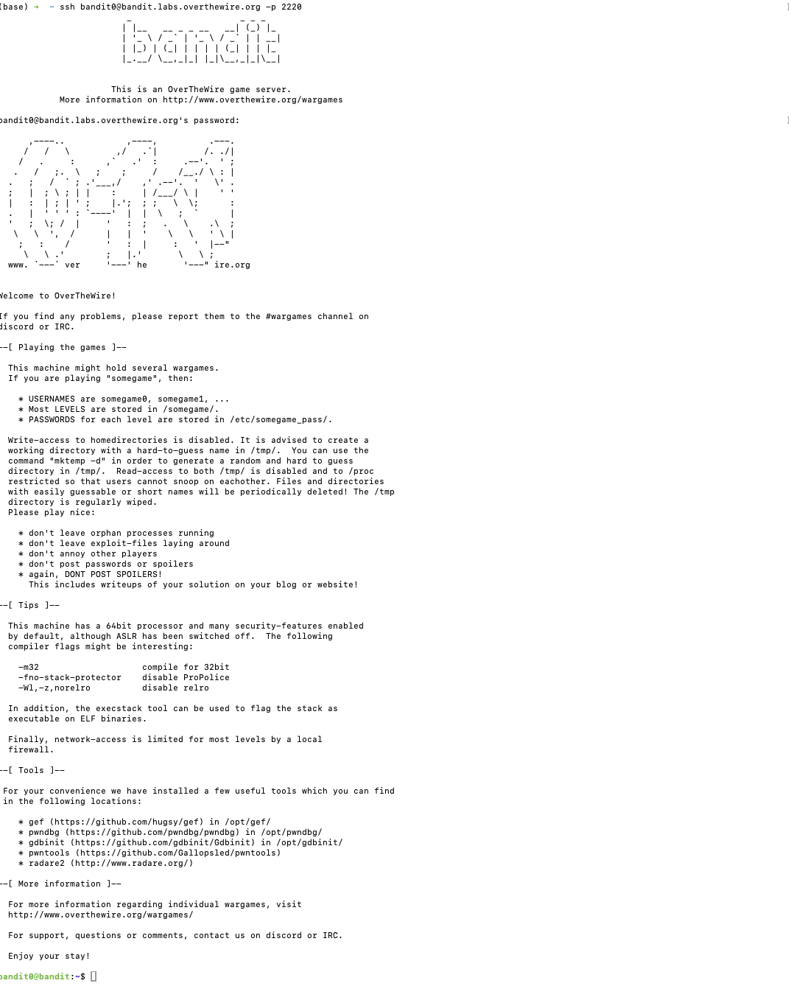
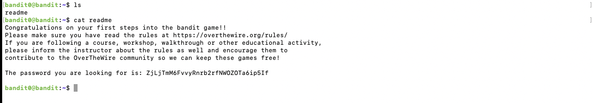
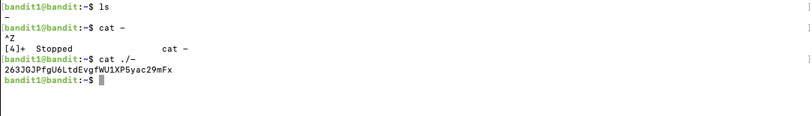
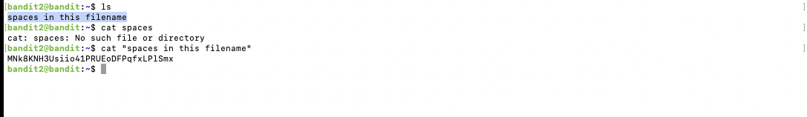
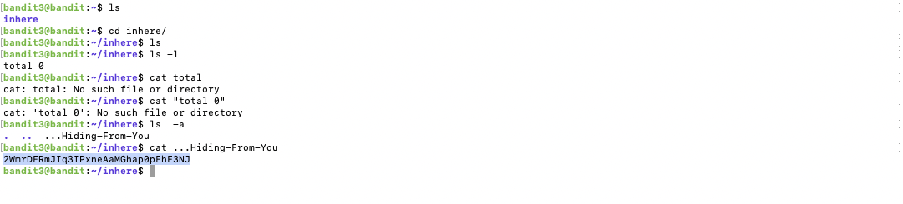

# Blog 1: Getting Started with Bandit – Basic Linux Commands


## Introduction

Welcome to the first installment of my 7-week journey through the OverTheWire Bandit challenges! Bandit is an excellent platform for beginners to get hands-on experience with Linux command-line interface (CLI) and foundational security concepts. In this blog, I’ll walk you through the initial levels (0–4), covering basic navigation, file operations, and hidden files. By the end of this, you’ll have a solid understanding of essential Linux commands and how to apply them in real-world scenarios.

---

## Levels Overview

- **Levels Covered:** 0–4
- **Theme:** Introduction to Linux CLI, basic navigation, hidden files, and file viewing.
- **Skills Learned:**
  - Using SSH to connect to remote servers
  - Navigating the Linux file system
  - Listing and viewing files, including hidden ones
  - Understanding file types

---

## Level-by-Level Walkthrough

### Level 0: Connecting with SSH

- **Objective:** Connect to the Bandit server using SSH.
- **Challenge Description:** The goal of this level is for you to log into the game using SSH.
- **Commands/Tools Introduced:** `ssh`

#### Solution:

1. **Connecting to the Server:**
   To start, use the SSH command provided by OverTheWire to connect to the Bandit server.
   ```bash
   ssh bandit0@bandit.labs.overthewire.org -p 2220
   ```
   -p command is used to specify the port you wanna run on your ssh terminal, if you don't specify that then the command will run on the port 22 and you will not be able to login the game. 

2. **Entering the Password:**
   The initial password for Bandit Level 0 is `bandit0`.



---

### Level 1: Read a File

- **Objective:** Find the file that contains the password for the next level.
- **Challenge Description:** The password for the next level is stored in a file called `readme` located in the home directory. Use this password to log into bandit1 using SSH. Whenever you find a password for a level, use SSH (on port 2220) to log into that level and continue the game.
- **Commands/Tools Introduced:** `ls`, `cat`

#### Solution:

1. **Listing Files:**
   Use the `ls` command to list all files in the current directory.
   ```bash
   ls
   ```
   Output:
   ```
   readme
   ```
2. **Viewing File Content:**
   Use the `cat` command to display the contents of the `readme` file.
   ```bash
   cat readme
   ```
   Output:
   ```
    Congratulations on your first steps into the bandit game!!
    Please make sure you have read the rules at https://overthewire.org/rules/
    If you are following a course, workshop, walkthrough or other educational activity,
    please inform the instructor about the rules as well and encourage them to
    contribute to the OverTheWire community so we can keep these games free!

    The password you are looking for is: ZjLjTmM6FvvyRnrb2rfNWOZOTa6ip5If

   ```
   This reveals the password for Bandit Level 1.



---

### Level 2: Unusual named Files

- **Objective:** Find the password in a file.
- **Challenge Description:** The password for the next level is stored in a file called - located in the home directory.
- **Commands/Tools Introduced:** `ls -a`, `cat`

#### Solution:

1. **Listing All Files:**
    Use `ls` to list all files.
   ```bash
   ls
   ```
   Output:
   ```
   -
   ```
2. **Viewing the Hidden File:**
   Use the `cat` command to read the contents of the file that contains the passowrd.
   ```bash
   cat ./-
   ```
   Output:
   ```
   263JGJPfgU6LtdEvgfWU1XP5yac29mFx
   ```
   This displays the password for the next level.

   Note -We use ./- instead of - as `-` is a special symbol in linux and it is not recommended to start a filename with `-`. Hence, if we run the command cat `-`, it will not return anything. 



---

### Level 3: Spaces in the Filename

- **Objective:** Find the password hidden in a file.
- **Challenge Description:** The password for the next level is stored in a file called spaces in this filename located in the home directory. 
- **Commands/Tools Introduced:** `ls`, `cat`

#### Solution:

1. **Listing All Files:**
    Use `ls` to list all files.
   ```bash
   ls
   ```
   Output:
   ```
   spaces in this filename
   ```
2. **Opening the file:**
    Attempting to read the file without quotes will result in an error since spaces are interpreted as separating multiple file names.
   ```bash
   cat spaces in this filename
   ```
    Output:

    ```bash
    cat: spaces: No such file or directory
    cat: in: No such file or directory
    cat: this: No such file or directory
    cat: filename: No such file or directory
    ```

    Therefore we use double quotes to handble the filename correctly and get the commands. We can also use the `/` instead of the double quotes to skip spaces within the filenames. 

     ```bash
   cat "spaces in this filename"
   ```
    Output:

    ```bash
   MNk8KNH3Usiio41PRUEoDFPqfxLPlSmx
    ```



---

### Level 4: Navigating Hidden Directories

- **Objective:** Discover the hidden directory and find the password within.
- **Challenge Description:** The password for the next level is stored in a hidden file in the inhere directory.
- **Commands/Tools Introduced:** `cd`, `ls`, `cat`

#### Solution:


1. **Navigating to the Directory:**
   Change directory.
   ```bash
   cd .inhere
   ```
2. **Listing Directories Including Hidden Ones:**
   I started by running `ls` to check the contents of the `inhere` directory, but nothing showed up.
   ```bash
   ls
   ```
   Output:
   ```bash
    total 0
   ```
3. **Revealing Hidden Files:**
    Realizing there might be hidden files, I used ls -a to list everything, including hidden files. That’s when I spotted ...Hiding-From-You.
   ```bash
   ls -a
   ```
   Output:
   ```
  .  ..  ...Hiding-From-You
   ```
4. **Viewing the Password File:**
   ```bash
   cat ...Hiding-From-You
   ```
   Output:
   ```
    2WmrDFRmJIq3IPxneAaMGhap0pFhF3NJ
   ```
   This reveals the password for Bandit Level 5.



---

## Key Takeaways

- **SSH:** Learned how to establish secure connections to remote servers using SSH.
- **Linux Navigation:** Mastered basic commands like `ls`, `cd`, and `cat` for navigating the file system and viewing file contents.
- **Hidden Files:** Understood how to identify and interact with hidden files using `ls -a`.
---

## Cheatsheet for This Week

### **Commands Covered:**
- `ssh`: Connect to a remote server.
  ```bash
  ssh username@hostname -p port
  ```
- `ls`: List directory contents.
  ```bash
  ls
  ```
- `ls -a`: List all files, including hidden ones.
  ```bash
  ls -a
  ```
- `cat`: Concatenate and display file content.
  ```bash
  cat filename
  ```

### **Concepts:**
- **SSH Basics:** Securely connecting to remote servers.
- **File Navigation:** Moving through directories and listing files.
- **Hidden Files:** Identifying and accessing hidden files. 
---

## What’s Next

Next week, we’ll delve into **file permissions and manipulation** in Linux, covering Bandit Levels 5–9. Understanding permissions is crucial for managing file access and ensuring system security. We’ll explore commands like `chmod`, `chown`, and more advanced file operations.

---

## Additional Resources

- [OverTheWire Bandit Official Website](https://overthewire.org/wargames/bandit/)
- [SSH Tutorial for Beginners](https://www.digitalocean.com/community/tutorials/ssh-essentials-working-with-ssh-servers-clients-and-keys)
- [Linux Command Line Basics](https://www.gnu.org/software/bash/manual/bash.html)
- [Understanding Hidden Files in Linux](https://www.linux.com/training-tutorials/understanding-hidden-files-linux/)

---
