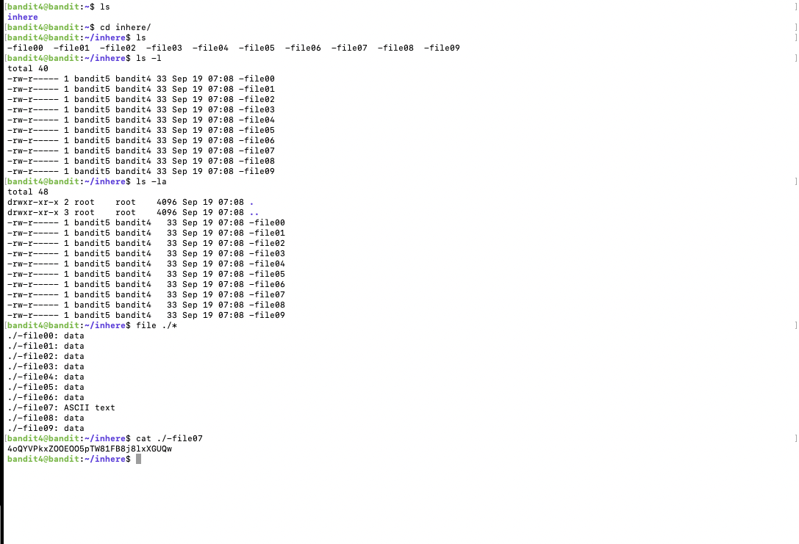
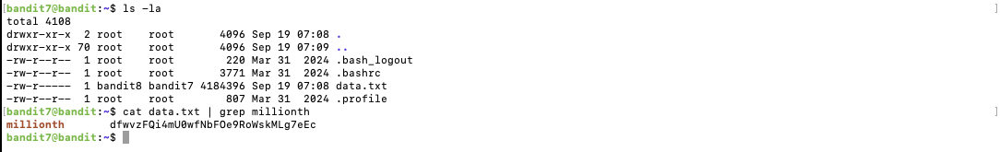
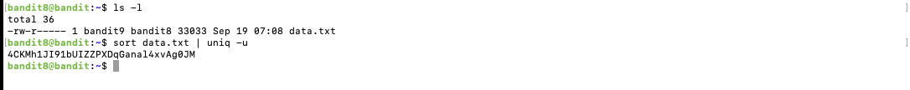

# Blog 2: Understanding Permissions and File Manipulation in Linux

## Introduction

In this blog, we’ll dive deeper into file permissions, file size filtering, and file redirection, covering Levels 5 through 9 of the OverTheWire Bandit challenge. Knowing these skills is essential for navigating Linux environments effectively and understanding the basics of file security and manipulation. Let’s get started!

---

## Levels Overview

- **Levels Covered:** 5–9
- **Theme:** File permissions, file manipulation, and filtering files by properties.
- **Skills Learned:**m
  - Changing file permissions using `chod`
  - Filtering files by size and owner
  - Using file redirection

---

## Level-by-Level Walkthrough

### Level 5: Working with File types

- **Objective:**Discover the human readable file and find the password within.
- **Challenge Description:** The password for the next level is stored in the only human-readable file in the inhere directory
- **Commands/Tools Introduced:** `file`

#### Solution:

1. **Navigating to the `inhere` directory:**
   I started by running `ls` in my home directory and noticed a folder named `inhere`. Since the files I needed were in this directory, I used the `cd` command to change into the `inhere/` directory.
   ```bash
   cd inhere/
   ```
   Output:
2. **Listing the files with ls:**
   Once inside the inhere directory, I ran ls to list the files. I saw that the files had unusual names starting with a dash (-), like -file00, -file01, etc.
   ```bash
   ls
   ```
3. **Listing the files in long format with permissions (ls -l):**
   I used ls -l to get detailed information about the files, including their permissions, owner, group, and size. Each file turned out to be 33 bytes in size, and the permissions showed that only the owner had read access.
   
   This step was important to understand the file permissions and confirm the small size of the files. Knowing that the files were only 33 bytes made it more likely that the files contained something simple, like a password.

4. **Checking file types with file:**
    Since I was looking for a human-readable file, I used the file command to check the type of each file. Most of the files were just data, but -file07 was identified as an ASCII text file, which meant it was likely to contain the password.
   ```bash
   file ./*
   ```
   Output:
   ```bash
   ./-file00: data
   ./-file01: data
   ./-file02: data
   ./-file03: data
   ./-file04: data
   ./-file05: data
   ./-file06: data
   ./-file07: ASCII text
   ./-file08: data
   ./-file09: data
   ```

   Running file allowed me to quickly distinguish between data files and text files. Since only one file was human-readable (ASCII text), it helped me narrow down the file that likely contained the password without manually checking every file.
6. **Reading the File:**
   I used `cat` to retrieve the password from the human readable file.
   ```bash
   cat ./-file07
   ```
   Output: `4oQYVPkxZOOEOO5pTW81FB8j8lxXGUQw`



---

### Level 6: Human-readable files and non-executable files

- **Objective:** The password is stored in a file with a specific size.
- **Challenge Description:** Find a file in the `inhere` directory that is exactly 1033 bytes, humar readable and not executable
- **Commands/Tools Introduced:** `find`, `ls`, `cat`

#### Solution:

1. **Navigating to the `inhere` directory:**
   First, I used `ls` in my home directory to check for any directories. I found `inhere` and navigated into it using the `cd` command.
   ```bash
   cd inhere/
   ```
2. **Listing all files and directories:**
   I used `ls -la` to list all files, including hidden files, inside the `inhere` directory. This showed me several directories labeled `maybehere00` through `maybehere19`, each containing multiple files.
   ```bash
   ls -la
   ```
3. **Identifying human-readable files with `file`:**
   To avoid manually opening each file, I used the `file` command to check the type of every file in each directory. This helped me filter out files that were not human-readable.
   ```bash
   file */{.,}*
   ```
   I then used `grep` to filter out files that were not `ASCII text` and further refined the search by excluding files with very long lines.
   ```bash
   file */{.,}* | grep "ASCII text" | grep -v ', with very long lines'
   ```

   The `file` command saved me a lot of time by identifying which files were human-readable, and using `grep` helped me further narrow down the list by excluding unwanted results.

4. **Filtering by size using `du`:**
   Since the task required the file to be exactly 1033 bytes, I used the `du` command to find files of that exact size.
   ```bash
   du -b -a | grep 1033
   ```
   This revealed one file, `maybehere07/.file2`, which matched the size criteria.
   ```bash
   ./maybehere07/.file2
   ```
   This step was crucial to ensure that I found a file with the exact required size, reducing the number of files I needed to check manually.

5. **Checking if the file is non-executable:**
   I used the `find` command to search for non-executable files, which helped confirm that the file `maybehere07/.file2` was not executable.
   ```bash
   find . -type f -size 1033c ! -executable -exec file '{}' \; | grep ASCII
   ```

   The file needed to be non-executable, so using `find` helped ensure that I met this criterion.

6. **Reading the contents of the file:**
   Finally, I used `cat` to read the contents of the file and retrieve the password.
   ```bash
   cat ./maybehere07/.file2
   ```
   Output:
   ```bash
   HWasnPhtq9AVKe0dmk45nxy20cvUa6EG
   ```
[Level 6 Screenshot](images/level6.txt)

---

### Level 7: User specific file and group ownership

- **Objective:** Get the password from a file with specific permissions.
- **Challenge Description:** The password for the next level is stored somewhere on the server and has all of the following properties:
   owned by user bandit7
   owned by group bandit6
   33 bytes in size
- **Commands/Tools Introduced:** `find`, file ownership (`-user`, `-group`).

#### Solution:

1. **Getting the file:**
   I used the `find` command with the following options:
      -type f, because we are looking for a file
      -user bandit7, to find files owned by the ‘bandit7’ user
      -group bandit6, to find files owned by the ‘bandit6’ group
      -size 33c, to find files of size 33 bytes
   ```bash
   find / -type f -user bandit7 -group bandit6 -size 33c
   ```

   Now this returned me the output attatched below adding a `2>/dev/null` returned only the files that I required. I got this trick using as I studied a shell course at my unversity. 

2. **Getting the passowrd:**
   To the get file that had the password I added `2>/dev/null` to the bash command above and I got this output
   ```bash
   var/lib/dpkg/info/bandit7.password
   ```
2. **Verifying the Output:**
   To confirm, I used `cat` to check that the password was written successfully.
   ```bash
   cat var/lib/dpkg/info/bandit7.password
   ```
   Output: `morbNTDkSW6jIlUc0ymOdMaLnOlFVAaj`

[Level 7 Screenshot](images/level7.txt)

---

### Level 8: Grep and piping

- **Objective:** Find a line which has the password
- **Challenge Description:** The password for the next level is stored in the file data.txt next to the word millionth
- **Commands/Tools Introduced:** `grep`, `|`.

#### Solution:


1. **Listing files in the home directory:**
   First, I used `ls -la` to list all files in my home directory. This revealed a large file named `data.txt`.
   ```bash
   ls -la
   ```
   Output 
   ```bash 
   drwxr-xr-x  2 root    root       4096 Sep 19 07:08 .
   drwxr-xr-x 70 root    root       4096 Sep 19 07:09 ..
   -rw-r--r--  1 root    root        220 Mar 31  2024 .bash_logout
   -rw-r--r--  1 root    root       3771 Mar 31  2024 .bashrc
   -rw-r-----  1 bandit8 bandit7 4184396 Sep 19 07:08 data.txt
   -rw-r--r--  1 root    root        807 Mar 31  2024 .profile
   ```

   The file data.txt was quite large, containing 4184396 bytes of data, making it impractical to manually search through it and get the password.

2. **Using grep to find the word "millionth" and password:**
   Since the password is next to the word "millionth", I used grep to search for lines containing that word in the data.txt file.
   ```bash
   cat data.txt | grep millionth
   ```
      Output 
   ```bash 
   millionth       dfvuzFQi4muU8wfNbFOe9ROwksMLg7eEc

   ```

   Using grep allowed me to efficiently search through the file and find the line containing "millionth" along with the password.The password was displayed on the same line as the word "millionth", and I was able to use it to progress to the next level.



---

### Level 9: Uniq and sort

- **Objective:** Find a line which has the password
- **Challenge Description:** The password for the next level is stored in the file data.txt and is the only line of text that occurs only once
- **Commands/Tools Introduced:** `grep`, `sort`, `uniq`

#### Solution:
1. **Listing files in the home directory:**
   First, I listed the contents of my home directory to find the file `data.txt`.
   ```bash
   ls -l
   ```
2. **Sorting and finding the unique line:**
   Since the password is on a line that appears only once, I used the sort command to organize the file and then piped it to uniq -u to filter out only the unique line.
   ```bash
   sort data.txt | uniq -u
   ```

   Output:
   ```
   4CKMh1JI91bUIZZPXDqGanal4xvAg0JM
   ```

   Similar to the previous one, I knew these commands since I have some background on how to use these (sort and uniq) commands.



---

## Key Takeaways

- **Permissions and Ownership:** I learned how to identify files based on ownership and permissions using `find` with flags for user, group, and file size.
- **File Type Identification:** Using `file` helped me quickly find human-readable files among various data files.
- **File Filtering:** I practiced searching for specific text in large files with `grep`, sorting with `sort`, and identifying unique lines with `uniq`.
- **Non-executable Files:** I used `find` to filter out executable files and focus only on non-executable ones for certain challenges.

---

## Cheatsheet for This Week

### **Commands Covered:**
- `find`: Search for files based on criteria (size, ownership, non-executable).
  ```bash
  find / -user bandit8 -group bandit7 -size 33c ! -executable
  ```
- `file`: Identify file types (e.g., ASCII, data).
  ```bash
  file ./*
  ```
- `grep`: Search for patterns within files.
  ```bash
  grep "pattern" filename
  ```
- `sort` and `uniq`: Sort and find unique lines in a file.
  ```bash
  sort filename | uniq -u
  ```
- `du`: Check file sizes.
  ```bash
  du -b -a | grep 1033
  ```
---

## Progress Gallery

### **Level 5: Working with File types**


### **Level 6:  Human-readable files and non-executable files**


### **Level 7: User specific file and group ownership*


### **Level 8: Grep and piping**


### **Level 9: Uniq and sort**


---

## What’s Next

Next week, I’ll be covering Levels 10–14, where we’ll dive into **advanced file manipulation and searching within files** 

---

## Additional Resources

- [OverTheWire Bandit Official Website](https://overthewire.org/wargames/bandit/)
- [Linux Permissions Guide](https://www.linux.com/training-tutorials/linux-permissions-guide/)
- [Find Command in Linux](https://linuxize.com/post/how-to-use-find-command-in-linux/)

---
