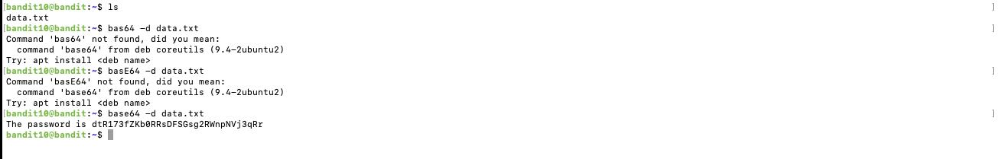
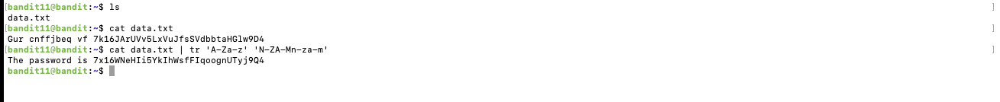

# Blog 3: Getting Started with Bandit

## Levels Overview

- **Levels Covered:** 10–15
- **Theme:** Encoding and decoding data, SSH key authentication, and submitting passwords using different tools.
- **Skills Learned:**
   - Decoding base64 and Rot13 encoded data
   - Decompressing hexdumped data
   - Using SSH key authentication
   - Submitting passwords using Netcat and OpenSSL

---

## Level-by-Level Walkthrough

### Level 10: base64 Encoding

- **Challenge Description:** The password for the next level is stored in the file data.txt, which contains base64 encoded data.
- **Commands/Tools Introduced:** `base64`

#### Solution:

1. **Connecting to the Server:**
   Connect to the Bandit Level 10 server using the password obtained from the previous level.

2. **Reading the Password:**
   We cat the `data.txt` file and see that the content is base64 encoded.
   
3. **Decoding the Base64 Data:**
   We use the `base64` command to decode the data and display the password.
   ```bash
   cat data.txt | base64 --decode
   ```
   This reveals the password for Bandit Level 11.



---

### Level 11: Rot13 Encoding

- **Objective:** Find the password hidden in a file.
- **Challenge Description:** The password for the next level is stored in the file data.txt, which contains Rot13 encoded data.
- **Commands/Tools Introduced:** `tr`

#### Solution:

1. **Connecting to the Server:**
   Connect to the Bandit Level 11 server using the password obtained from the previous level.

2. **Reading the Password:**
   We cat the `data.txt` file and see that the content is Rot13 encoded.

3. **Decoding the Rot13 Data:**
   We use the `tr` command to decode the data and display the password.
   ```bash
   cat data.txt | tr 'A-Za-z' 'N-ZA-Mn-za-m'
   ```
   This reveals the password for Bandit Level 12.




---

### Level 12: Hexdump to ASCII   

- **Objective:** Find the password hidden in a file.
- **Challenge Description:** The password for the next level is stored in the file data.txt, which contains hexdumped data that has been repeatedly compressed.
- **Commands/Tools Introduced:** `xxd`, `tr`, `gzip`, `bzip2`, `zcat`

#### Solution:

1. **Connecting to the Server:**
   Connect to the Bandit Level 12 server using the password obtained from the previous level.

2. **Reading the Password:**
   We cat the `data.txt` file and see that the content is hexdumped. We also see the header `1f8b0800` which indicates that the data is compressed using gzip.
   We repeatedly decompress the data using `gzip`, `bzip2`, and `zcat` until we get the password.
   Headers for different compression formats:
   - gzip: `1f8b0800`
   - bzip2: `425a68`
   - xz: `fd377a585a00`

3. **Getting the Final Data:**
   In the end we see a file named data8.bin which contains the password.

[Level 12 Screenshot](images/Level%2013txt)


---

### Level 13: SSH Key Authentication

- **Objective:** Find the password hidden in a file.
- **Challenge Description:** The password for the next level is stored in /etc/bandit_pass/bandit14 and can only be read by user bandit14. For this level, you don’t get the next password, but you get a private SSH key that can be used to log into the next level.
- **Commands/Tools Introduced:** `ssh`, `chmod`

#### Solution:

1. **Connecting to the Server:**
   Connect to the Bandit Level 13 server using the password obtained from the previous level.

2. **Reading the Password:**
   We see that the password for the next level is stored in `/etc/bandit_pass/bandit14` and can only be read by user bandit14. This prompts us to use the private SSH key provided to log in as bandit14.

3. **Using the Private Key:**
   We save the private key to a file on our local machine and change its permissions to make it usable.
   ```bash
   chmod 600 sshkey.private
   ```
   We then use this private key to SSH into the next level.
   ```bash
   ssh -i sshkey.private bandit14@localhost
   ```
   This logs us into Bandit Level 14.
   Once in, we can read the password for the next level.

[Level 13 Screenshot](images/Level14.txt)

---

### Level 14: Netcat

- **Objective:** Find the password hidden in a file.
- **Challenge Description:** The password for the next level can be retrieved by submitting the password of the current level to port 30000 on localhost.
- **Commands/Tools Introduced:** `nc`

#### Solution:

1. **Connecting to the Server:**
   Connect to the Bandit Level 14 server using the password obtained from the previous level.

2. **Submitting the Password:**
   We submit the password for Bandit Level 14 to port 30000 on localhost using `nc`.

3. **Retrieving the Password:**
   We send the password using `nc` and receive the password for the next level.

[Level 14 Screenshot](images/Level15.txt)


---

### Level 15: OpenSSL

- **Objective:** Find the password hidden in a file.
- **Challenge Description:** The password for the next level can be retrieved by submitting the password of the current level to port 30001 on localhost using SSL encryption.
- **Commands/Tools Introduced:** `openssl`

#### Solution:

1. **Connecting to the Server:**
   Connect to the Bandit Level 15 server using the password obtained from the previous level.

2. **Submitting the Password:**
   We submit the password for Bandit Level 15 to port 30001 on localhost using `openssl`. Same as the previous level, instead of using `nc`, we use `openssl`.
   ```bash
   openssl s_client -connect localhost:30001
   ```

3. **Retrieving the Password:**
   We send the password using `openssl` and receive the password for the next level.

[Level 15 Screenshot](images/Level%2016.txt)

---


## Key Takeaways

- **Base64 Encoding (Level 10):** 
  - Use the `base64 --decode` command to decode base64 encoded data.

- **Rot13 Encoding (Level 11):**
  - Use the `tr 'A-Za-z' 'N-ZA-Mn-za-m'` command to decode Rot13 encoded data.

- **Hexdump to ASCII (Level 12):**
  - Identify the compression format using file headers (gzip: `1f8b0800`, bzip2: `425a68`, xz: `fd377a585a00`).
  - Use `gzip`, `bzip2`, and `zcat` to decompress repeatedly until you retrieve the password.

- **SSH Key Authentication (Level 13):**
  - Save the provided private SSH key, change its permissions with `chmod 600`, and use it to SSH into the next level.

- **Netcat (Level 14):**
  - Use `nc` to submit the current level's password to a specific port (30000) to retrieve the next level's password.

- **OpenSSL (Level 15):**
  - Use `openssl s_client -connect localhost:30001` to submit the password over SSL and receive the next level's password.

## Cheatsheet

```bash
# Level 10: Base64 Decoding
cat data.txt | base64 --decode

# Level 11: Rot13 Decoding
cat data.txt | tr 'A-Za-z' 'N-ZA-Mn-za-m'

# Level 12: Decompressing Hexdump
# Identify headers for compression
# Use the following commands repetitively based on the header
gzip -d data.txt   # for gzip
bzip2 -d data.txt  # for bzip2
zcat data.txt      # for zcat

# Level 13: Using SSH Key
chmod 600 sshkey.private
ssh -i sshkey.private bandit14@localhost

# Level 14: Submitting Password with Netcat
echo "current_password" | nc localhost 30000

# Level 15: Submitting Password with OpenSSL
openssl s_client -connect localhost:30001
```